# Access Authorization 使用授權

## 簡介

- 目標：了解 Oracle APEX 中的授權（Authorization）概念、建立與套用授權方案，以及使用 Access Control 管理角色與使用者。

- 成功標準：能建立一個共用的授權方案、將其套用到應用或頁面元件，並使用 Access Control Administration 管理使用者與角色。

## Podcast

用聽的，幫助你瞭解內容。

[下課後的 Apex Podcast Platforms - Flink by Firstory](https://open.firstory.me/user/cmcezyey605rl01zc6k215vo3/platforms)

## 授權（Authorization）是什麼？

授權是根據使用者權限限制對應用程式中頁面或元件（region、item、button 等）使用的機制。
  - 簡單說：控制角色能用那些功能，使用那些頁面


## 授權方案（Authorization Scheme）

在 Apex 中，授權方案是定義存取控制邏輯的共用元件。

可以用授權方案管理以下對象的存取權限：
- App 
- 單一頁面
- 頁面內的個別元件（region / item / button）

常見使用情境：
- 管理員專用頁面或按鈕（Administration Rights）
- 編輯功能只對 Contributor 顯示
- 報表僅對指定角色或使用者開放

## 授權方案的執行方式

若使用者嘗試存取受保護的頁面或元件，Apex 會在 SHOW-PAGE process 過程中的某個時間點, 執行授權方案的驗證邏輯，決定是否允許存取。
  - 你可以選擇授權方案的驗證時機（evaluation point）, 例如：新 Session, 每次拜訪頁面等. 

如果授權驗證成功, 使用者可以存取該頁面或元件；如果失敗, 則會顯示錯誤訊息或導向錯誤頁面。


## 實作使用授權的方式

兩個選項可以選擇：
1. 自行建立授權方案，並套用到管理對象
2. 使用 Access Control feature page，使用該功能的頁面管理角色與授權。

以下先說明第一種方式，再介紹第二種方式。


##  建立授權方案

授權方案是共享元件
- 多個頁面、元件可以共用同一個授權方案，當授權邏輯相同時。

建立授權方案的基本步驟：
1. 建立授權方案，定義驗證邏輯及執行時機
2. 將授權方案套用到管理目標(應用程式、頁面、或元件)

### 詳細步驟：

S1. 進入 App Home -> Shared Components -> Security -> Authorization Schemes。

S2. 點選 Create，輸入方案名稱，選擇方案型態 (Scheme Type)

- 方案型態可以是簡單的運算式(Expression) 或 PL/SQL function、 Exists SQL Query
  - 他們必須回傳 TRUE/FALSE 的結果

我們會在下一節說明如何撰寫驗證邏輯。

S3. 設定錯誤訊息，以便當驗證失敗時顯示。


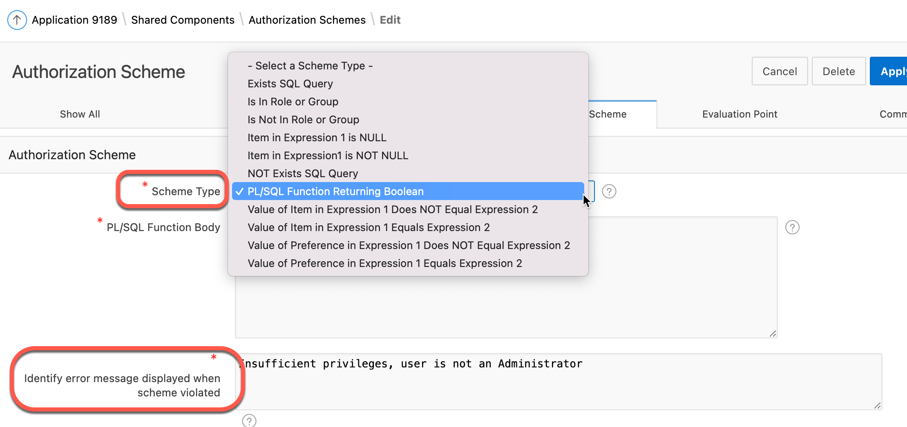

S4. 選擇驗證時機(Evaluation Point)

Apex 提供四個選項：
- Once per session：每次新 Session 時驗證一次
- Once per page view: 每次頁面呈現時驗證
- Once per component: 每次元件呈現時驗證
- Always: 每次存取時都驗證

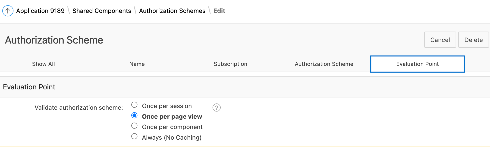


### 將授權方案套用到目標（Attach to target）

授權管理的對象可以是: Page, Region, Item, Button 等元件

這些元件有一個 Security 屬性區，設定 Authorization Scheme 屬性，撰擇要套用的授權方案。

Ex: App 的 Authorization Scheme 

Path: App > Shared Components > Security > Authorization Scheme

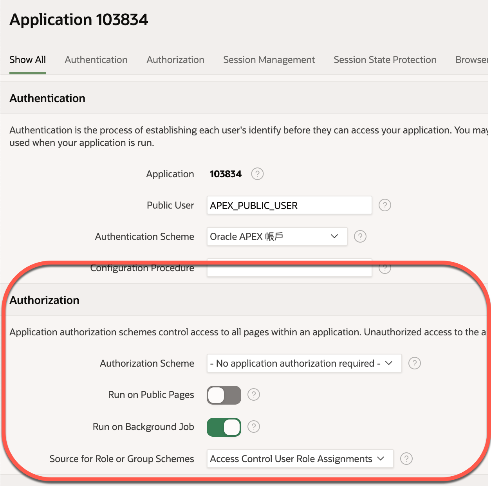

Ex: Page 的 Security > Authorization Scheme

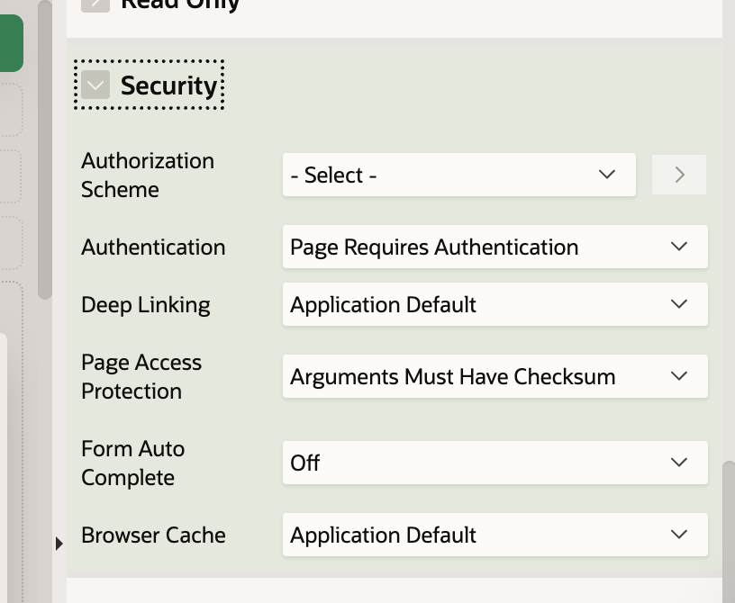

Ex: Region 的 Security > Authorization Scheme

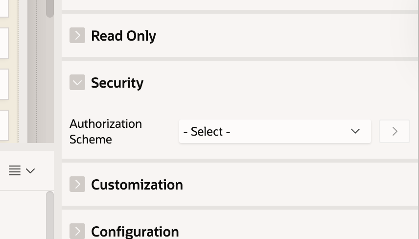

### 撰寫授權方案的驗證邏輯

原則:

- 可以使用運算式、PL/SQL function、Exists SQL Query 等方式撰寫驗證邏輯
- 驗證邏輯最終必須回傳 TRUE/FALSE


### 範例: 只限 admin 使用者可使用

步驟:

1. 建立一個 PL/SQL Function Returning Boolean
2. 在 function block 中, 使用內建變數 `:APP_USER` 取得目前使用者名稱。
3. 撰寫邏輯判斷是否為 admin 使用者，回傳 TRUE 或 FALSE。

```sql
-- 範例：只有 admin 使用者可通過
BEGIN
	RETURN :APP_USER = 'ADMIN';
END;
```

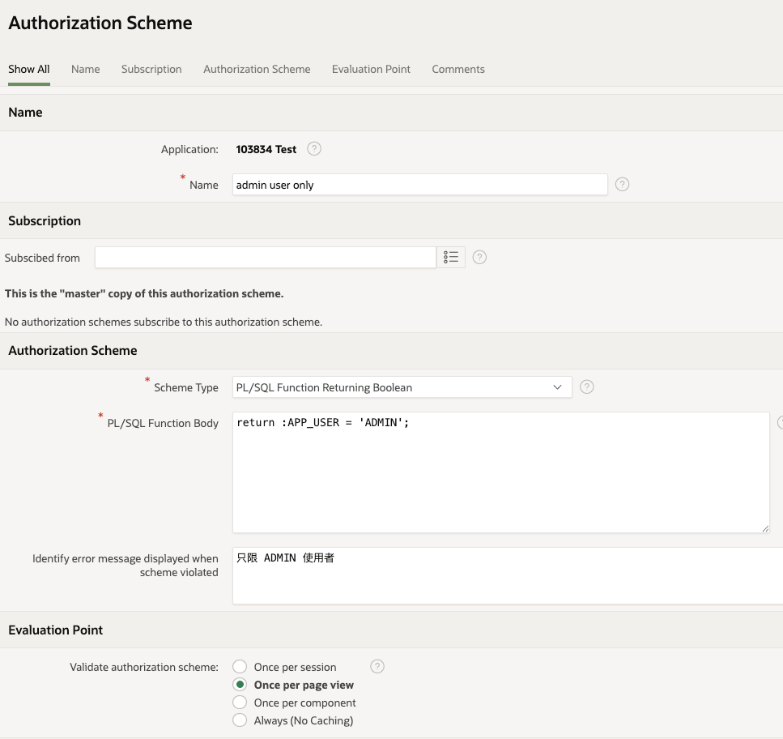


## Access Control Administration Page（存取權管控頁面）

你可以使用 APEX 內建的 Access Control feature page，來管理應用程式中的使用者與角色。

使用 Page Wizard 新增 Access Control feature page，APEX 會自動建立：

- Access Control Administration Page
- 內建角色（Administrator、Contributor、Reader）
- 預設授權方案（Administration Rights、Contributor Rights、Reader Rights）

### Access Control Administration Page 

使用 Page Wizard 將 Access Control feature page 新增到應用程式後


使用 Access Control page 可以新增 User 並指定角色。
- 系統預設三個角色：Administrator、Contributor、Reader 及其對應的授權方案。

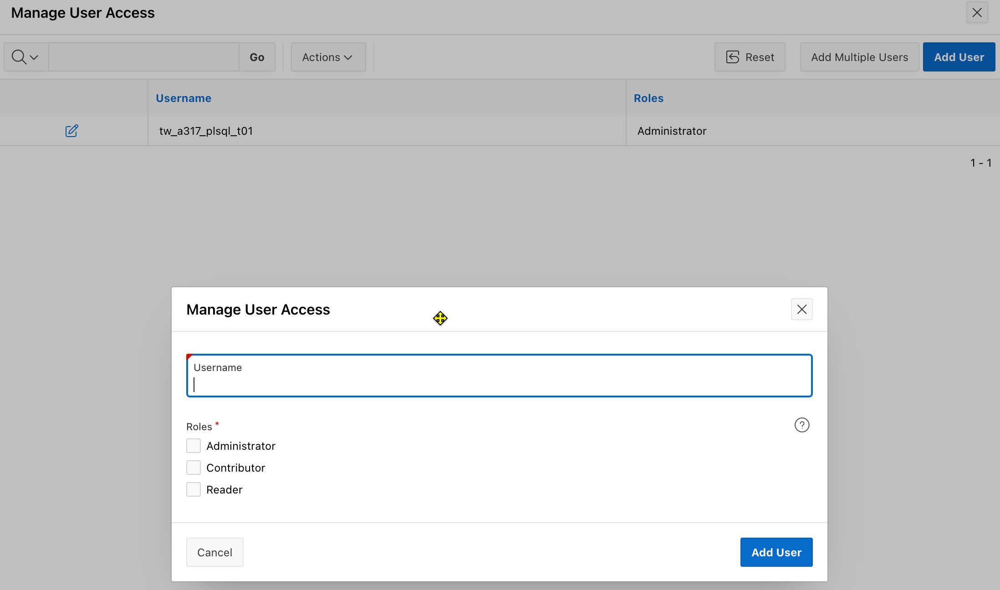

預設「使用控制」規則:
- 預設只有在 Access Control 中定義的使用者，才能登入應用程式。
- 其它使用者，即使通過驗證，也無法存取應用程式。


### 修改「使用控制」規則

也可以允許其它通過驗證的使用者存取應用程式，即使他們不在 先前定義的 Access Control 清單中。

點選 Access Control 按鈕

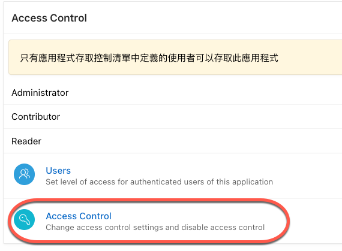

開啟 "Any authenticated user may access this application"

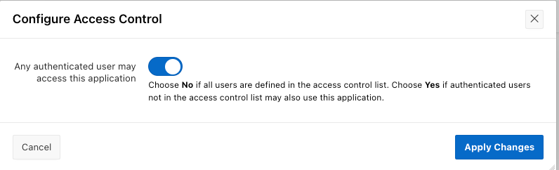


## Access Control Administration Page 的技術補充

### Q: Wizard 會自動為我們加入那些東西？

- Page
  - Access Control Administration Page
- Access roles:
  - Administrator, Contributor, Reader 
- Authorization schemes:
  - Administration Rights, Contributor Rights, Reader Rights
- Application Setting 
  - ACCESS_CONTROL_SCOPE
  - 路徑: App > Shared Components > Application Settings

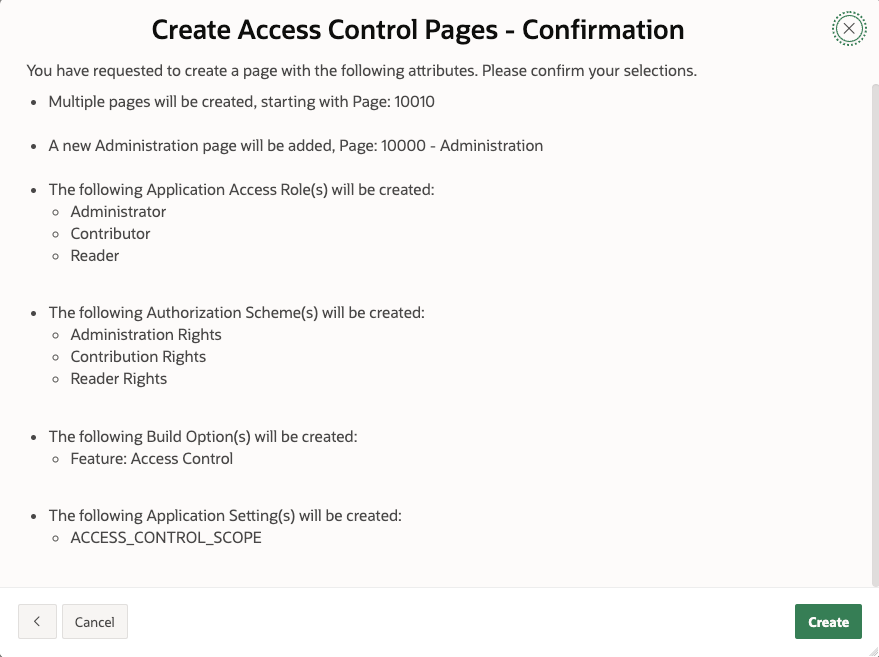

### Q: 如何為 APP 新增角色？

在 Access Control Page 中只能指定使用者的角色，無法新增角色。

若要新增角色，必需到 App > Shared Components > Security > Application Access Control 新增。

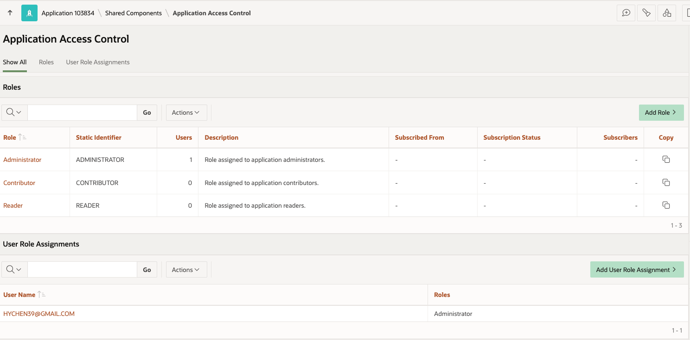

### Q: ACL 的使用者、角色、及指派關係存放在那裡？

Apex 提供以下的 VIEWs 查詢相關資料：
- APEX_APP_ACL_USERS: ACL 使用者清單
- APEX_APP_ACL_ROLES: ACL 角色清單
- APEX_APP_ACL_USER_ROLES: ACL 使用者與角色的對應關係

### Q: 如何使手 ACL_ROLES 的資料建立授權方案？

- Scheme Type 選擇 "Is in Role or Group"
- Type 選擇 "Application Role", 表示定義在特定 App 內的角色
- Name(s) 欄位：輸入一個或多個角色名稱，以逗號分隔

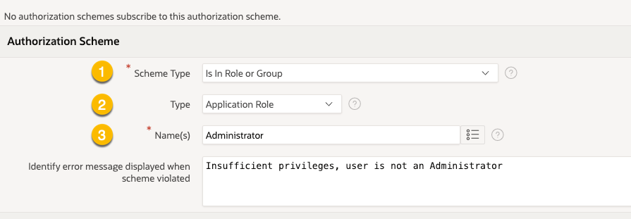

應用程式的預設授權資料來源(Source for Role or Group Schemes) 為 ACL 中定義的角色。

要查看預設的授權資料來源，路徑為： App > Application Definition > Security > Authorization

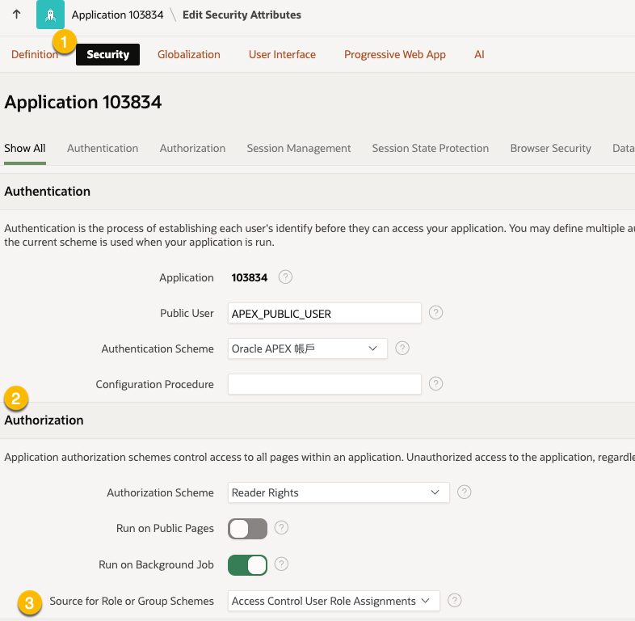

### Q: 我可以自己寫程式查詢 ACL tables 中相關資料嗎？

範例: 查詢某個使用者(APP_USER)在某個應用程式(APP_ID)中，是否具有 Administrator 角色

```sql
DECLARE
    -- 符合查詢條件資料的筆數。
	-- 當大於 1 時表示該使用者具有 Administrator 角色
	l_count NUMBER;
BEGIN
	SELECT COUNT(*) INTO l_count
	-- From 子句串接三張 ACL 相關的表格
	FROM APEX_APP_ACL_USERS u
	JOIN APEX_APP_ACL_USER_ROLES ur ON u.user_id = ur.user_id
	JOIN APEX_APP_ACL_ROLES r ON ur.role_id = r.role_id
	-- Where 子句指定查詢條件: 使用者名稱(APP_USER)、角色名稱、應用程式 ID (APP_ID)
	-- APP_USER, APP_ID 為內建變數, 所以要加上冒號(:)
	WHERE u.username = :APP_USER
		AND r.role_name = 'Administrator'
		AND u.app_id = :APP_ID;

	RETURN l_count > 0;
END;
```

## 結語

- Apex 提供簡便的授權管理機制，免除自行撰寫複雜的存取控制邏輯。
- 善用 Access Control feature page，可以輕鬆管理使用者與角色，提升應用程式的安全性與可維護性。


