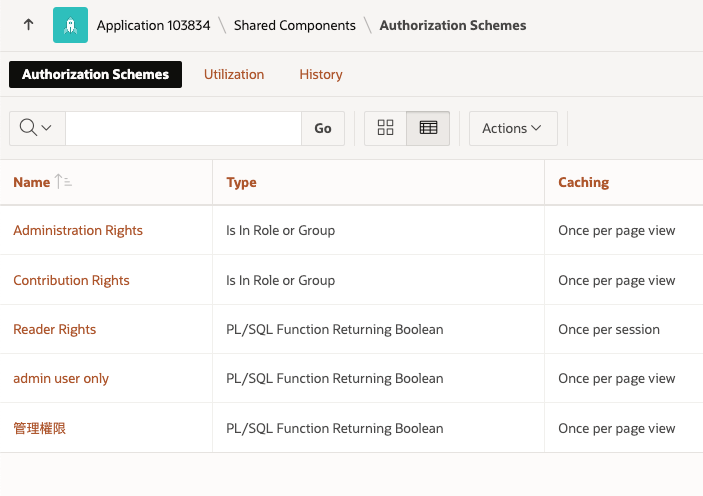
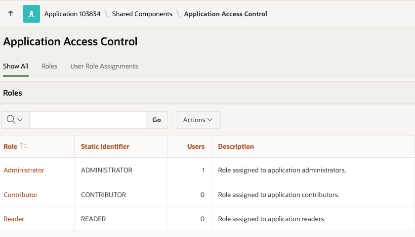
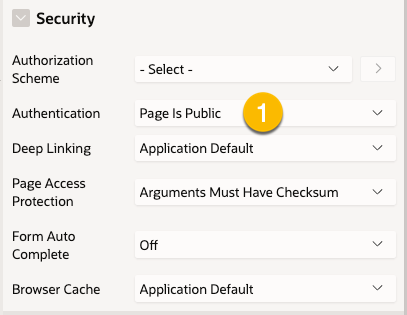
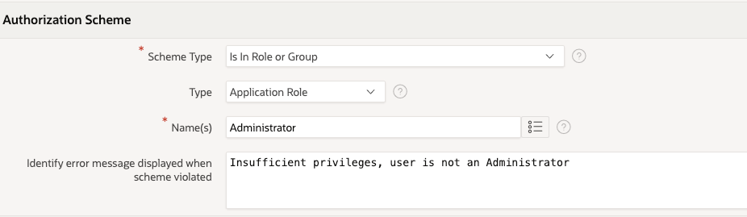
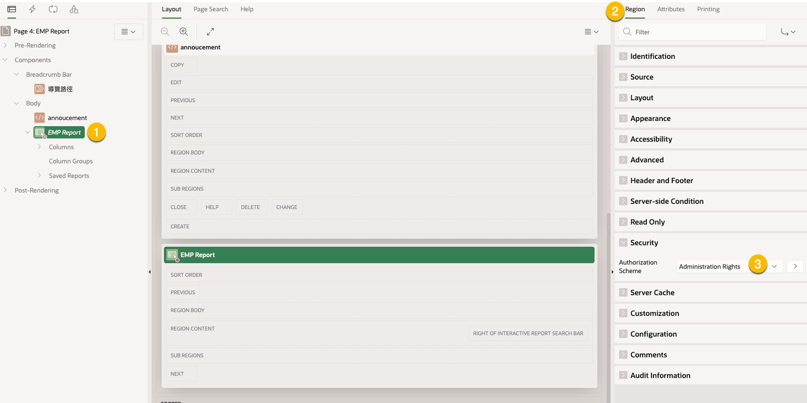
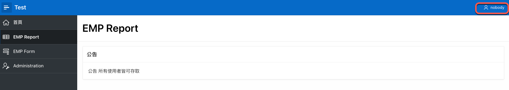
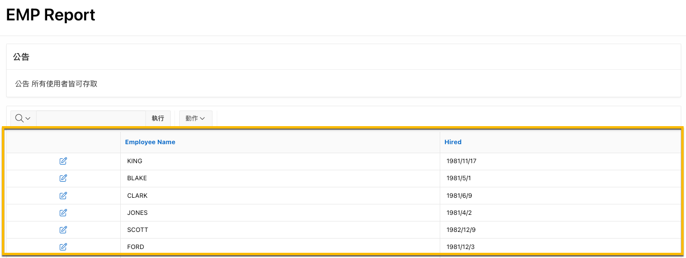

# Case Study: 頁面中部份內容做授權控管

## Use Case 

APP 的首頁及 EMP Report 頁面的存取設為 public, 表示未經驗證的使用者也可以瀏覽。

EMP Report 中的 Report Region 則做授權控管，只有具 Administrator 角色的使用者，才能瀏覽 Report。

## 準備應用程式

下載 [test_app.sql](../../app_src/test_app.sql)

將 test_app.sql 匯入到 Oracle APEX 中，建立應用程式。

`test_app` 中已加入 Access Control feature page。

APP 中已有以下授權方案:
- Administration Rights
- Contributor Rights
- Reader Rights
- admin user only 
- 管理權限

ACL 中的角色: Administrator, Contributor, Reader

首頁(page 1) 及 EMP Report(page 4) 的 Authentication 皆設為 `Page is Public`, 表示未經驗證的使用者也可以瀏覽。

## 步驟

### 檢視 Administration Rights 授權方案

路徑: App > Shared Components > Security > Authorization Scheme > Administration Rights

- Scheme Type: Is in Role or Group
- Type: Application Role
- Name(s): Administrator

Name(s) 欄位的值需和 ACL 中的角色名稱相同。

### 套用 Administration Rights 授權方案到 Report Region

1. 瀏覽 EMP Report 頁面(page 4)，選擇 `EMP Report` Region

2. 撰擇屬性 Security > Authorization Scheme

3. 選擇 `Administration Rights`

### 測試

1. 開啟 test_app 應用程式. 

因為首頁(page 1) 設為 Public, 所以可以直接瀏覽，不用身份驗證。

2. 點選 `EMP Report` 頁面連結，你只能看到 `公告`區域，無法看到 `EMP Report` 區域。

3. 點選 `EMP Form` 選單連結，進行身份驗證後登入。

4. 再次瀏覽 `EMP Report` 頁面，你可以看到 `EMP Report` 區域。

